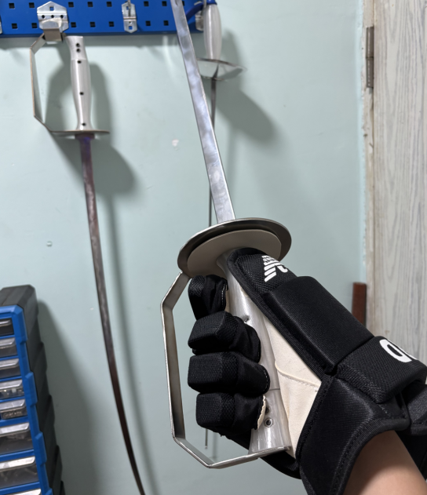

# 廉价HEMA武器计划

## 不对任何安全问题负责，请自负一切后果

# 说明

因个人体质问题，由于身高导致的手掌宽大，并且需要适应大号冰球手。

DIY大护手军刀，以满足对练需求。

非史诗设计，尽量采用现代工业的廉价材料。


# Feature

- 总成本百元左右
- 刀条板材切割（淘宝代工方便）
- 护手板材切割/钣金（便宜，代工方便）
- 龙骨柄（穿心柄/老鼠尾需要焊接螺纹）
- 打印握把
- 打印安全头
- 加长握把（匹配195身高手型）


# 设计理念

本人并非Hema爱好者，而是生存狂菜刀党。
练hema的目的是储备械斗能力，以便在抢劫的时候用。
尽可能的避免双杀。
需要考虑室内作战，并且便于携带。
需要有压制常规生活武器的能力。
目标为城市非农非兵人口（打不过）。
因长枪和草叉等太过imba，不考虑单刀进枪之类的东西。


主要假想对向武器：
- 匕首
- 短棍
- 长棍
- 砍刀
- 柴刀/菜刀

并且要保证武器廉价易得，技术可复用到常见生活刀型，如卢旺达甘蔗刀，18剁等。

因大碗军刀独特的自带护手带来的绝佳防御，所以选择军刀作为技术基础。
而且在hema中联系人数较多，便于训练。

其实原来是练日刀的，因训练规矩太多，放弃了。
身体原因无法正坐，裸足训练，竹刀手感差异太大。

其他备选：
- 梅瑟德砍（护手容易制作）
- 手半剑（十字护手容易制作）
- 日刀（护手容易制作/大货多）


# 版本

## 通用

```
通用模型\hema安全头.stl
通用模型\基础刀根_测试用.stp
```

设计了打印的安全头 **！！！未经实战验证！！！**

**不出意外以后都是按这个基础刀根设计护手和握把，仅适合195身高的超大手。**

本项目所有武器握把都是这个尺寸，请自行酌量修改（刀条，握把，护手）


## V1

整体重量900g左右，重心13cm。



为下图最后两把“圆盘D护”


### 刀条

分别设计了直刀和弯刀，材质为3mm厚的65Mn（弹簧钢）淬火硬料。

```
V1\弯刀条_3mm_65Mn硬料.dxf
V1\直刀条_3mm_65Mn硬料.dxf
```

- 龙骨刀根
- 刺击减伤9.5kg
- 斩击减伤**未测试**

### 护手

找淘宝可以接受stp模型的钣金代工商家，我不会画钣金图。

材质测试用的304不锈钢，但A3，弹簧钢应该都可以。

```
V1\护手_001_圆盘D护.stp
```

打样了2种护手，3mm厚不锈钢，重量为615g左右，过重。

重心问题比较严重，重心严重偏离刀身，转动惯量过大。

临时用角磨机切割了一个，重量减少为410g左右。

经测试手感良好。

模型为切割后的版本，但感觉不伦不类的，已经不是军刀的大碗了，更像spadroon。

### 握把

建议壁厚4，填充20%。

```
V1\大碗通用握把_V1.stp
```

纺锤形，尽量贴近实战型而不是竞技型。

用M4柱头螺栓和六角螺母固定，长度忘了应该是M4*18吧，忘了，你们多买几种吧，嘻嘻。

握把和护手中间需要垫一块厚度1mm~1.5mm的皮革或者其他布料，面巾纸也行。

护手开槽长22mm，刀根宽20mm，为了便于安装，这就造成了装好后护手会前后动。

搞个东西压在握把和护手中间，就可以增加摩擦力，也可以防止拇指磕到护手。

# 计划

## V1阶段（进行中）

尝试65Mn均厚刀条是否可以用于兵击训练。

- 65Mn弹簧钢均厚刀条（完成）
- 刺击减伤测试（完成）
- 斩击减伤测试
- 空挥手感测试
- 实战测试
- 钣金护手（算完成了，这个版本就这样）
- 打印安全头（完成）
- 打印握把（完成）
- 大碗护手重新设计
- 握把优化
- 其他潜在的优化

需要实战训练，咨询馆内兵击老手意见。

预计空挥一个月，对练两场。

优化整体设计，对标400~800水平大货军刀。

## V2阶段

了解梅瑟，手半剑，中剑等结构，调研/打样。

- 直剑+十字格类型
- 大弧度刀条（波刀）
- 反曲刀刀条
- 德砍

## V3阶段

开刃试斩，刀鞘携具。